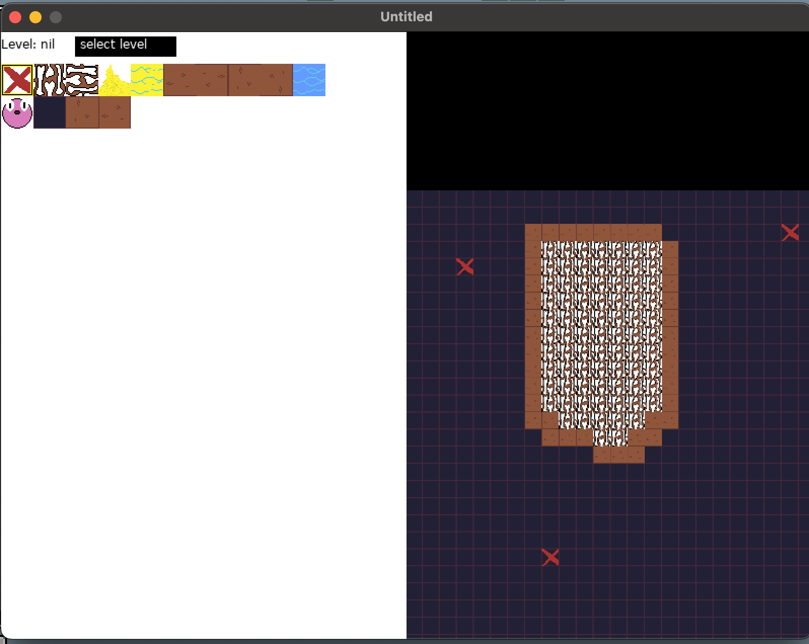

# Bone Sea

So this is an unfinished project I'm working on called bone sea. Jayden wanted to work on an undertale style game and I thought that would be fun. So currently there is no "game", it's just a level editor. But, the levels are fully saved and loaded. It's actually neat because it's all at runtime, so adding a file or image there's no reload.

So if you make a level in this right now it will work in the final game. 

NOTE: the editor cannot save to disk in compiled form, this is a saftey check performed by love2d, if you want to save, you need to run it as a developer with the cloned repo. This is a dev tool.

To do this, download love from love2d.org

Then open the command line and run run "git clone https://github.com/NikolasDaynard/tilemapped"

Then run the command "love path/to/folder/with/main.lua"

And the game should run with full write permission within the directory